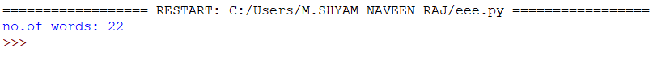

# Word-count
## AIM:
To write a python program for getting the word count from a text.
## EQUIPEMENT'S REQUIRED: 
PC
Anaconda - Python 3.7
## ALGORITHM: 
### Step 1:
open a new file

### Step 2: 
write some content to file 1 and save it
### Step 3: 
read the same file and save it in a variable
### Step 4:  
get length of the variable using len function
### Step 5: 
print the number of words 
 

## PROGRAM:
```
with open("word.txt","w+") as f1:
    f1.write("Essay writing is not everyone’s cup of tea")
    f1.write("Essay writing is not everyone’s cup of tea")
    f1.write("Essay writing is not everyone’s cup of tea")
with open("word.txt","r")as f:
    data=f.read()
    x=data.split()
    print("no.of words:",len(x))
```

### OUTPUT:



## RESULT:
Thus the program is written to find the word count from a text.
